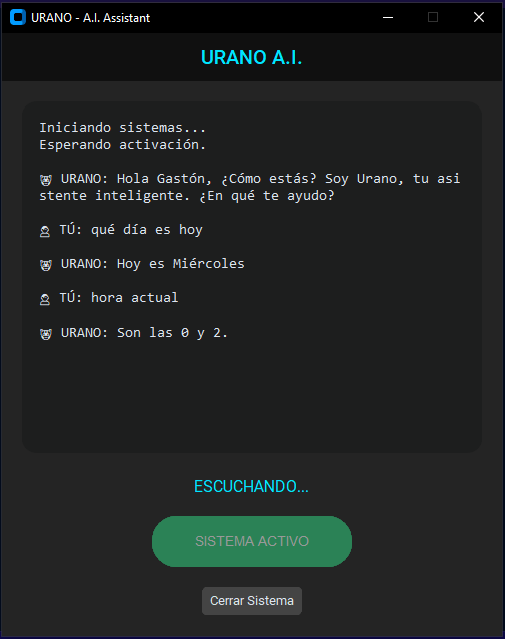

# 🤖 URANO v2.0 - Asistente Virtual con GUI

**Urano v2.0** es la evolución del asistente virtual original, ahora transformado en una aplicación de escritorio moderna y robusta. Esta versión integra una **Interfaz Gráfica de Usuario (GUI)** construida con `CustomTkinter` y utiliza **procesamiento multihilo (Threading)** para garantizar una experiencia fluida sin congelamientos durante la escucha y el procesamiento de voz.


## 📸 Captura de Pantalla



## ✨ Novedades de la Versión 2.0

A diferencia de la versión de consola, esta actualización incluye:
* **Interfaz Gráfica Moderna (Dark Mode):** Panel visual con historial de chat (Usuario vs. IA) y botones de control.
* **Ejecución Asíncrona (Threading):** El proceso de escucha se ejecuta en un hilo secundario, permitiendo que la ventana responda y se pueda cerrar incluso mientras el asistente está esperando órdenes.
* **Log Visual:** Visualización en tiempo real de lo que el asistente detecta y responde en una caja de texto con scroll.
* **Gestión de Errores COM:** Implementación de `pythoncom` para la estabilidad del motor de voz en entornos multihilo.

## 📋 Funcionalidades

El asistente mantiene y mejora sus capacidades originales:
* **Youtube:** Búsqueda y reproducción directa de videos.
* **Google:** Búsqueda inteligente (limpia las palabras clave de la oración).
* **Wikipedia:** Resúmenes hablados de cualquier tópico.
* **Información:** Fecha y hora actual.
* **Control de Voz:** Detección automática de voces en español instaladas en el sistema (priorizando variantes latinas).

## 🛠️ Tecnologías

* **[CustomTkinter](https://github.com/TomSchimansky/CustomTkinter):** Para la creación de la interfaz moderna.
* **SpeechRecognition:** Motor de reconocimiento de voz.
* **Pyttsx3:** Motor de síntesis de voz offline.
* **Threading:** Librería estándar para concurrencia.
* **PyWhatKit, Wikipedia, PyJokes:** Módulos de funcionalidad.

## ⚙️ Instalación y Requisitos

1.  **Clonar el repositorio:**
    ```bash
    git clone [https://github.com/tu-usuario/urano-gui-assistant.git](https://github.com/tu-usuario/urano-gui-assistant.git)
    cd urano-gui-assistant
    ```

2.  **Instalar librerías:**
    Es necesario instalar `customtkinter` y las librerías de voz/web:
    ```bash
    pip install customtkinter speechrecognition pyttsx3 pywhatkit wikipedia pyjokes pywin32
    ```

## 🚀 Ejecución

Simplemente corre el archivo principal:

```bash
python main.py
